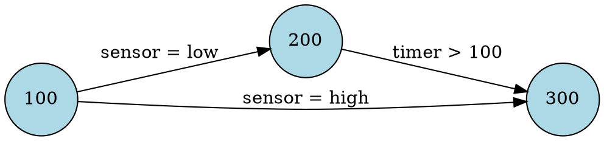

# 🦀 fsm-extractor: PLC State Machine Extractor & Analyzer

**fsm-extractor** is a **fast, safe, and research-grade** command-line utility written in **Rust** for extracting, analyzing, and verifying **Finite State Machines (FSMs)** from PLC project XML files. Built with industrial control system security in mind, it implements state signature generation based on the **SAIN (Specification-based Anomaly detection for Industrial control Networks)** research paper.

---

## ✨ Key Features

### 1. Core Extraction
* **Complete XML parsing** using `roxmltree` for efficient and zero-copy data access
* Extracts **function blocks** from `<function-block-declaration>` and `<program-declaration>` tags
* Identifies **case statements** and extracts state machine logic with full fidelity
* Builds **state transition graphs** with proper state and transition tracking
* Supports **multiple function blocks** with individual analysis per block

### 2. Advanced Boolean Expression Parser
* **Full boolean logic support**: `AND`, `OR`, `NOT`, and nested parentheses
* **Operator precedence**: Correctly handles `NOT` > `AND` > `OR`
* **Complex expressions**: Parses conditions like `(A=1 OR B=2) AND C=3` and `NOT (temp > 100)`
* **DNF conversion**: Converts all expressions to Disjunctive Normal Form for signature generation
* **De Morgan's laws**: Automatically applies logical transformations for `NOT` operations
* **All comparison operators**: `=`, `<>`, `<`, `<=`, `>`, `>=`
* **Preserves complex values**: Handles expressions like `L_T1 <= (PU1_LowLevel + Htol)`

### 3. State Signature Generation (SAIN Implementation)
* **Multiple path signatures**: Correctly handles disjunctive (OR) logic when multiple paths reach the same state
* **Path tracking**: Uses transition indices to distinguish between different transitions with same source/destination
* **DNF-based signatures**: Each state can have multiple valid signatures (one per reachable path)
* **Runtime verification**: Provides `verify_state()` for anomaly detection in live systems
* **Cross-product expansion**: Combines conditions from sequential transitions along paths
* **Redundancy elimination**: Removes duplicate conditions within signatures

### 4. FSM Analysis Suite
* **Unreachable state detection**: Identifies states with no incoming paths from initial states
* **Dead-end state detection**: Finds states with no outgoing transitions
* **Cycle detection**: Uses Kosaraju's algorithm for strongly connected components
* **Statistical analysis**: Computes metrics like average transitions per state
* **Signature-based verification**: Compare runtime state against expected signatures

### 5. Multiple Output Formats
* **Text tables**: Pretty-printed ASCII tables with color-coded analysis results
* **JSON**: Structured output with optional analysis and signature data
* **Markdown**: Documentation-ready format with tables and statistics
* **Graphviz DOT**: Visual FSM diagrams for rendering with `dot`

### 6. Architecture (Rust Advantages)
* **Modular Design**: Separated modules (`xml_parser`, `fsm`, `analysis`, `output`) for maintainability
* **Type Safety**: Leverages **Rust's ownership system** for guaranteed memory safety
* **Zero-cost abstractions**: Near-native performance without runtime overhead
* **Error Handling**: Comprehensive, user-friendly errors with `anyhow` and `thiserror`
* **Parallel-ready**: Thread-safe data structures enable future parallelization

---

## 🎯 Use Cases

### 1. Industrial Control System (ICS) Security
* **Anomaly detection**: Generate signatures for normal FSM behavior
* **Runtime monitoring**: Verify PLC state transitions match expected patterns
* **Intrusion detection**: Detect unauthorized modifications to control logic
* **Compliance verification**: Ensure state machines follow safety specifications

### 2. Software Engineering
* **Static analysis**: Find unreachable code and dead-end states before deployment
* **Testing support**: Generate test cases covering all state transitions
* **Documentation**: Auto-generate FSM diagrams and transition tables
* **Refactoring**: Visualize complex state machines to identify simplification opportunities

### 3. Research & Education
* **FSM analysis algorithms**: Study cycle detection, path finding, and signature generation
* **Security research**: Explore PLC vulnerability detection through behavioral analysis
* **Formal verification**: Extract FSMs for input to model checkers and theorem provers

---

## 💻 CLI Interface

The tool provides a powerful command-line interface for various operations.

### Basic Extraction

```bash
# Extract FSMs and display as text tables (default)
fsm-extractor extract input.xml

# Extract to JSON with pretty formatting
fsm-extractor extract input.xml --format json -o output.json

# Extract specific function blocks only
fsm-extractor extract input.xml -F PRG_VGR_Ablauf,PRG_HBW_Ablauf -o filtered.json
```

### Analysis & Signatures

```bash
# Run all analysis checks (unreachable, dead-end, cycles, signatures)
fsm-extractor analyze input.xml --all

# Check for specific issues
fsm-extractor analyze input.xml --check-cycles --check-unreachable

# Show state signatures (for runtime verification)
fsm-extractor analyze input.xml --show-signatures

# Extract with embedded analysis results
fsm-extractor extract input.xml --format json --analyze -o with_analysis.json

# Extract with state signatures for anomaly detection
fsm-extractor extract input.xml --format json --signatures -o with_sigs.json

# Full analysis: FSM + statistics + signatures
fsm-extractor extract input.xml --format json --analyze --signatures -o full.json
```

### Visualization

```bash
# Generate Graphviz DOT file
fsm-extractor visualize input.xml -o fsm.dot

# Filter specific function blocks for cleaner diagrams
fsm-extractor visualize input.xml -f PRG_VGR_Ablauf -o vgr.dot

# Render to PNG (requires graphviz installed)
fsm-extractor visualize input.xml -o fsm.dot
dot -Tpng fsm.dot -o fsm.png
```

---

## 📊 Analysis Features

### Unreachable States
Identifies states that cannot be reached from any initial state (states with no incoming transitions):

```
⚠ Unreachable states found:
  - State 500
  - State 999
```

### Dead-End States
Finds states with no outgoing transitions (potential infinite loops or termination points):

```
⚠ Dead-end states found:
  - State 9999 (error handler)
```

### Cycle Detection
Uses strongly connected components to find cycles in the state graph:

```
ℹ Cycles detected:
  - 100 → 200 → 300 → 100
  - 150 (self-loop)
```

### State Signatures (SAIN Algorithm)
Generates runtime-verifiable signatures for each state based on all possible paths:

```
State Signatures:
  State 100: [initial]
  State 200: (sensor = low) OR (button = pressed)
  State 300: (sensor = low AND timer > 100) OR (button = pressed AND timer > 100)
```

**How Signatures Work:**
1. **Path Finding**: DFS traversal finds all paths from initial states
2. **Condition Extraction**: Collects transition conditions along each path
3. **DNF Conversion**: Complex boolean expressions converted to OR-of-ANDs
4. **Multiple Signatures**: States reachable via different paths get multiple valid signatures
5. **Runtime Verification**: Monitor can check if `current_state` matches ANY signature

---

## 🔬 Implementation Details

### Boolean Expression Parser
**Recursive Descent Parser with AST**

Tokenizer → Parser → AST → DNF Converter

```rust
// Input
"(temp > 100 OR pressure < 50) AND alarm = true"

// Tokenization
[LParen, Condition("temp > 100"), Or, Condition("pressure < 50"), 
 RParen, And, Condition("alarm = true")]

// Parse Tree (AST)
And(
  Or(Atomic(temp > 100), Atomic(pressure < 50)),
  Atomic(alarm = true)
)

// DNF Output (for signature generation)
[
  [temp > 100, alarm = true],    // Path 1
  [pressure < 50, alarm = true]  // Path 2
]
```

### Multiple Path Handling
**Critical Fix**: Uses transition indices to distinguish multiple transitions between same states

```rust
// Problem: Two transitions from State 10 to State 20
10 --[sensor=low]--> 20
10 --[button=pressed]--> 20

// Old (WRONG): Paths stored as [10, 20] - loses transition info
// Result: Only first transition found, creates single signature

// New (CORRECT): Paths stored as [(10, None), (20, Some(0))] and [(10, None), (20, Some(1))]
// Result: Two distinct signatures for State 20 (disjunctive OR)
```

### DNF Cross-Product
Combines conditions from sequential transitions:

```
// Path: State A --[X=1 OR Y=2]--> State B --[Z=3]--> State C

// Transition 1 DNF: [[X=1], [Y=2]]
// Transition 2 DNF: [[Z=3]]

// Cross-product for State C:
// [[X=1, Z=3], [Y=2, Z=3]]

// Meaning: State C requires EITHER (X=1 AND Z=3) OR (Y=2 AND Z=3)
```

---

## 🔧 Output Formats

### Text (Default)
```
Function Block: PRG_VGR_Ablauf
Case Variable: state

States: 15 | Transitions: 32

╭────────────────┬──────────────┬─────────────────────────────╮
│ Current State  │ Next State   │ Transition Condition         │
├────────────────┼──────────────┼─────────────────────────────┤
│ 100            │ 200          │ sensor = low                 │
│ 100            │ 300          │ sensor = high                │
╰────────────────┴──────────────┴─────────────────────────────╯

✓ No unreachable states
✓ No dead-end states
✓ No cycles detected
```

### JSON (Structured)
```json
{
  "fsm": {
    "function_blocks": [...],
    "metadata": {
      "source_file": "input.xml",
      "total_states": 45,
      "total_transitions": 87
    }
  },
  "analysis": {
    "PRG_VGR_Ablauf": {
      "total_states": 15,
      "unreachable_states": [],
      "cycles": []
    }
  },
  "signatures": {
    "PRG_VGR_Ablauf": {
      "case_variable": "state",
      "signatures": {
        "100": {
          "state_id": "100",
          "path_signatures": [
            {
              "conditions": [],
              "path_id": 0
            }
          ]
        },
        "200": {
          "state_id": "200",
          "path_signatures": [
            {
              "conditions": [
                {"variable": "sensor", "operator": "=", "value": "low"}
              ],
              "path_id": 0
            },
            {
              "conditions": [
                {"variable": "button", "operator": "=", "value": "pressed"}
              ],
              "path_id": 1
            }
          ]
        }
      }
    }
  }
}
```

### Markdown (Documentation)
```markdown
# FSM Extraction Report

**Source File:** input.xml
**Total States:** 45
**Total Transitions:** 87

## Function Block: PRG_VGR_Ablauf

| Current State | Next State | Transition Condition |
|---------------|------------|---------------------|
| 100           | 200        | sensor = low        |
| 100           | 300        | sensor = high       |

### State Signatures

| State | Signature Conditions              | Paths |
|-------|----------------------------------|-------|
| 100   | [initial]                        | 1     |
| 200   | (sensor = low) OR (button = ...) | 2     |
```

### Graphviz DOT (Visualization)


---

## 🧪 Testing

The project includes comprehensive tests covering:

* ✅ **XML Parsing**: Various PLC file formats and edge cases
* ✅ **FSM Construction**: State/transition graph building
* ✅ **Cycle Detection**: Acyclic and cyclic graphs
* ✅ **Boolean Parser**: Simple and complex expressions
* ✅ **DNF Conversion**: AND/OR/NOT transformations
* ✅ **De Morgan's Laws**: Logical negation correctness
* ✅ **Multiple Paths**: Disjunctive signature generation
* ✅ **Runtime Verification**: Signature matching accuracy
* ✅ **Cross-Product**: Path condition combinations

Run tests:
```bash
cargo test
cargo test --verbose  # Detailed output
cargo test test_parse_complex_and_or  # Specific test
```

---

## 📦 Installation

### From Source

```bash
# Clone the repository
git clone https://github.com/yourusername/fsm-extractor.git
cd fsm-extractor

# Build optimized release binary
cargo build --release

# Binary located at: target/release/fsm-extractor
# Copy to PATH or run directly
./target/release/fsm-extractor --help
```

### Dependencies

**Runtime:**
- None (statically linked Rust binary)

**Build:**
- Rust 1.70+ (install via [rustup](https://rustup.rs/))

**Optional (for visualization):**
- Graphviz (`dot` command) for rendering DOT files

---

## 🏗️ Project Structure

```
fsm-extractor/
├── src/
│   ├── main.rs              # CLI entry point with clap
│   ├── lib.rs               # Public API exports
│   ├── error.rs             # Error types (thiserror)
│   ├── xml_parser.rs        # XML parsing with roxmltree
│   ├── fsm/
│   │   ├── mod.rs           # FSM types and structures
│   │   ├── extractor.rs     # FSM extraction from XML
│   │   ├── function_block.rs
│   │   ├── state.rs
│   │   └── transition.rs
│   ├── analysis/
│   │   ├── mod.rs           # Analysis orchestration
│   │   ├── signatures.rs    # SAIN signature generation ⭐
│   │   ├── validator.rs     # Unreachable/dead state detection
│   │   ├── cycles.rs        # Cycle detection (Kosaraju SCC)
│   │   └── stats.rs         # Statistical analysis
│   └── output/
│       ├── mod.rs           # Output format abstraction
│       ├── text.rs          # ASCII table output
│       ├── json.rs          # JSON serialization
│       ├── markdown.rs      # Markdown generation
│       └── dot.rs           # Graphviz output
├── Cargo.toml               # Dependencies and metadata
└── README.md                # This file
```

---

## 🎓 Research Background

This tool implements the **state signature generation algorithm** from the SAIN paper:

> **SAIN: Specification-based Anomaly detection for Industrial control Networks**
>
> The approach generates unique signatures for each FSM state based on all possible execution paths. At runtime, the monitor verifies that observed variable values match at least one valid signature for the current state. Deviations indicate potential attacks or system malfunctions.

**Key Contributions of This Implementation:**
1. **Correct disjunctive logic**: Handles multiple paths with OR semantics (original paper requirement)
2. **Transition-level tracking**: Distinguishes multiple transitions between same states (fixes common implementation bug)
3. **Full boolean logic**: Supports complex conditions with AND/OR/NOT/parentheses (exceeds paper scope)
4. **DNF normalization**: Converts all expressions to canonical form for efficient matching

---

## 🤝 Contributing

Contributions welcome! Areas of interest:

- **Performance optimization**: Parallel FSM extraction for multi-GB XML files
- **Additional analysis**: Liveness properties, temporal logic checks
- **Export formats**: UPPAAL, NuSMV model checker inputs
- **Runtime monitoring**: Standalone daemon for live PLC verification
- **GUI frontend**: Web-based FSM visualization and analysis

---

## 📄 License

[Add your license here - MIT, Apache 2.0, GPL, etc.]

---

## 📚 References

- **SAIN Paper**: [Link to paper if public]
- **Rust Book**: https://doc.rust-lang.org/book/
- **Graphviz**: https://graphviz.org/
- **Kosaraju's Algorithm**: https://en.wikipedia.org/wiki/Kosaraju%27s_algorithm

---

## 🙏 Acknowledgments

Built with:
- 🦀 **Rust** - Performance + Safety
- 📊 **petgraph** - Graph algorithms
- 🎨 **colored** - Terminal colors
- 📋 **tabled** - ASCII tables
- 🔧 **clap** - CLI parsing
- 🌳 **roxmltree** - XML parsing

---

**Questions? Found a bug?** Open an issue on GitH